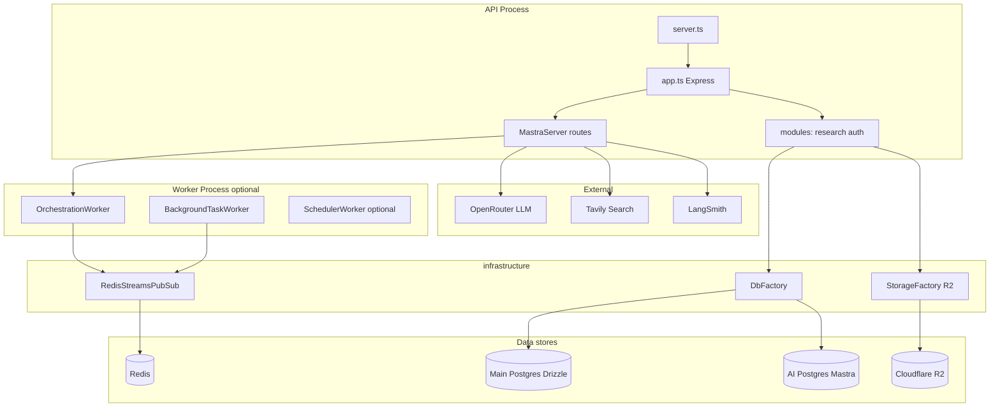
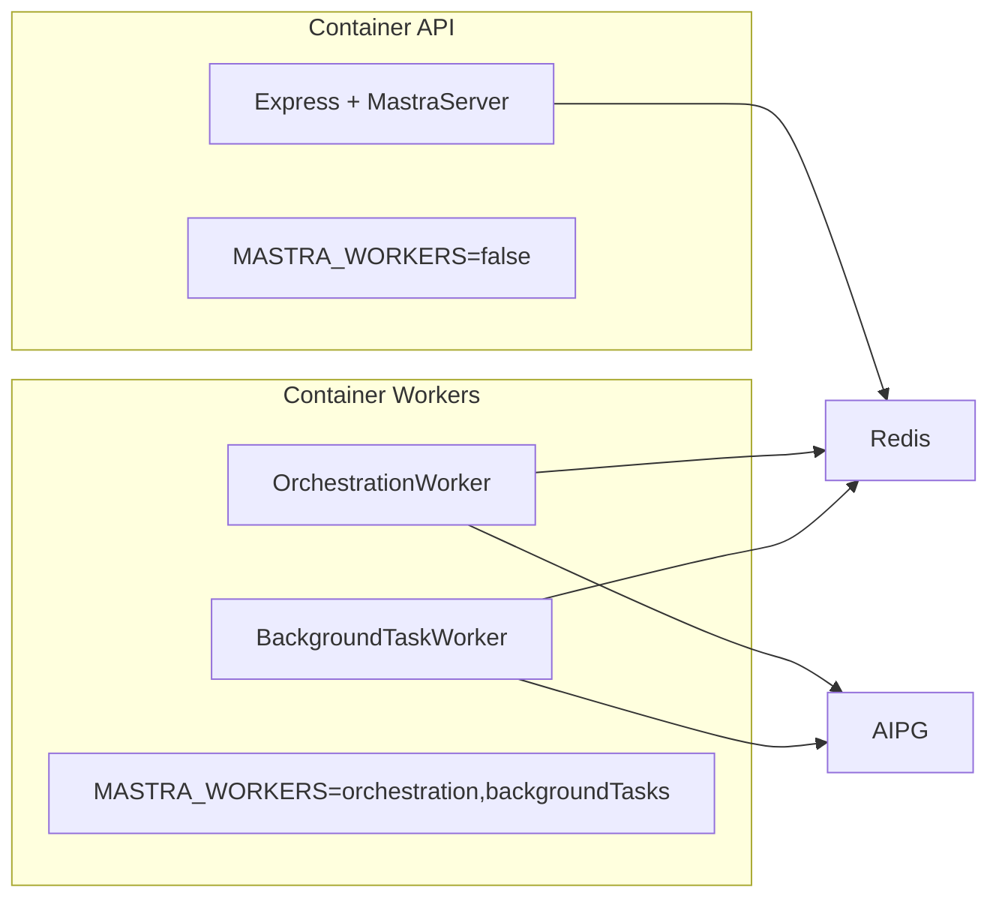
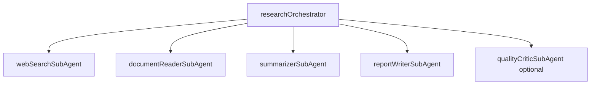
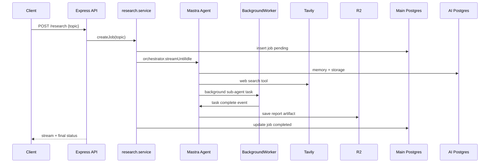

# Research Autonomous Agent

Single source of truth for scope, architecture, and phased delivery of the research-autonomous agent platform.

---

## 1. Vision & scope

**Research Autonomous Agent** accepts a research topic or question, runs a long-running investigation using web search and document tools, coordinates specialist sub-agents, persists conversation memory and artifacts, and returns a structured report (markdown/PDF) stored in Cloudflare R2.

### In scope (v1)

- API-triggered research jobs
- Streaming agent responses
- Artifact storage on R2
- LangSmith traces for observability
- Auth module (JWT + Google OAuth scaffold)

### Out of scope (v1)

- Multi-tenant billing
- Public marketplace
- Real-time collaborative editing

---

## 2. Functional requirements

| ID | Requirement |
|----|-------------|
| F1 | User submits research topic via REST API (`POST /api/v1/research`) |
| F2 | Orchestrator agent plans steps and delegates to sub-agents |
| F3 | Web search tool (Tavily) retrieves sources with citations |
| F4 | Document fetch + parse (URL/PDF) for deep reading |
| F5 | Summarizer sub-agent produces section summaries |
| F6 | Writer sub-agent produces final report |
| F7 | Artifacts (reports, raw sources) uploaded to Cloudflare R2 |
| F8 | Research job status: `pending → running → completed / failed` (main Postgres via Drizzle) |
| F9 | Conversation memory per research thread (Mastra memory + AI Postgres) |
| F10 | Streaming agent output to client (Mastra Express + `streamUntilIdle`) |
| F11 | Scheduled re-research workflows (optional Phase 4) |
| F12 | Auth: JWT + Google OAuth |

---

## 3. Non-functional requirements

| ID | Requirement | Target |
|----|-------------|--------|
| NF1 | Availability | 99.5% (single-region v1) |
| NF2 | Research job timeout | 10–30 min with background tasks |
| NF3 | Observability | LangSmith traces + Pino structured logs |
| NF4 | Security | Helmet, CORS, JWT, secrets in env, R2 signed URLs |
| NF5 | Scalability path | Split API vs worker processes via `MASTRA_WORKERS` |
| NF6 | Data retention | Mastra retention config on AI Postgres; app job records in main DB |
| NF7 | Modularity | Domain modules; no cross-module direct DB access |
| NF8 | Testability | Tools mocked; workflow step tests |

---

## 4. Architecture — modular monolith

The application is a **modular monolith**: one codebase, clear module boundaries, optional split deploy for API vs workers in production.



### Layer rules

| Layer | Path | Responsibility |
|-------|------|----------------|
| Entry | `server.ts`, `app.ts` | Boot, HTTP, Mastra mount |
| Domain | `src/modules/{research,auth}/` | Routes, services, schemas, DTOs |
| Agent | `src/mastra/` | Agents, tools, workflows, gateway |
| Infrastructure | `src/infrastructure/` | DB, storage, pubsub, queue adapters |
| Shared | `src/shared/` | Errors, middlewares, types |
| Config | `src/config/` | Env, `db()` bootstrap |

### Module pattern

Each domain module follows the same layout:

```
modules/research/
  research.routes.ts
  research.service.ts
  research.schema.ts      # Drizzle tables (main DB)
  research.types.ts
  index.ts
```

**Rule:** Modules call Mastra via `mastra.getAgent('research-orchestrator')` — never duplicate agent logic in services.

### Project folder tree (target)

```
agent-project/
├── PROJECT.md
├── package.json
├── drizzle.config.ts
├── .env.sample
└── src/
    ├── server.ts                 # Bootstrap only
    ├── app.ts                    # Express + MastraServer
    ├── config/
    │   ├── config.ts
    │   └── db.ts
    ├── db/
    │   ├── postgres-client.ts    # Drizzle main DB
    │   └── schema.ts
    ├── modules/
    │   ├── research/
    │   │   ├── research.routes.ts
    │   │   ├── research.service.ts
    │   │   ├── research.schema.ts
    │   │   ├── research.types.ts
    │   │   └── index.ts
    │   └── auth/
    │       ├── auth.routes.ts
    │       ├── auth.service.ts
    │       ├── auth.schema.ts
    │       └── index.ts
    ├── mastra/
    │   ├── index.ts              # Mastra registry
    │   ├── gateway.ts            # OpenRouter gateway
    │   ├── storage.ts            # PostgresStore (AI DB)
    │   ├── memory.ts             # Shared Memory instance
    │   ├── agents/
    │   │   ├── research-orchestrator.ts
    │   │   ├── web-search-agent.ts
    │   │   ├── document-reader-agent.ts
    │   │   ├── summarizer-agent.ts
    │   │   ├── report-writer-agent.ts
    │   │   └── critic-agent.ts
    │   ├── tools/
    │   │   ├── tavily-search.tool.ts
    │   │   ├── fetch-url.tool.ts
    │   │   ├── save-artifact.tool.ts
    │   │   └── get-artifact-url.tool.ts
    │   └── workflows/
    │       └── research-pipeline.ts
    ├── infrastructure/
    │   ├── database/
    │   │   ├── db.factory.ts
    │   │   ├── db.interface.ts
    │   │   └── provider/
    │   │       ├── postgres.singleton.ts
    │   │       └── postgres-pool.singleton.ts
    │   ├── storage/
    │   │   ├── storage.interface.ts
    │   │   ├── storage.factory.ts
    │   │   └── provider/
    │   │       └── r2.provider.ts
    │   ├── pubsub/
    │   │   └── redis-pubsub.ts     # Phase 4
    │   └── queue/
    │       └── bullmq.setup.ts     # Optional app-only jobs
    ├── workers/
    │   └── index.ts                # Phase 4 worker process
    ├── shared/
    │   ├── errors/
    │   └── middlewares/
    └── utils/
        └── logger.ts
```

---

## 5. Mastra feature map

| Mastra feature | Package | Use in this project |
|----------------|---------|-------------------|
| Mastra class | `@mastra/core` | Central registry (`mastra/index.ts`) |
| Agents | `@mastra/core` | Orchestrator + sub-agents |
| Tools | `@mastra/core` | Web search, R2, scrape, delegate |
| Sub-agents | `@mastra/core` | Specialist agents as delegation targets |
| Memory | `@mastra/memory` | Thread memory per research job |
| Storage | `@mastra/pg` | AI Postgres (`mastra/storage.ts`) |
| Gateway | `@mastra/core/llm` | OpenRouter (`mastra/gateway.ts`) |
| Express server | `@mastra/express` | Agent/workflow HTTP (`app.ts`) |
| Workflows | `@mastra/core` | Research pipeline (search → summarize → write) |
| Background tasks | `@mastra/core` | Long research runs without blocking stream |
| Workers | `@mastra/core` | Orchestration + background task workers |
| PubSub | `@mastra/redis-streams` | Distributed worker event bus (Phase 4) |
| Observability | `@mastra/observability` + `@mastra/langsmith` | LangSmith traces |
| Scorers | `@mastra/core` | Report quality evaluation (Phase 5) |

**Not needed for v1:** Vector store / RAG. Add `@mastra/pg` vector or a dedicated store in Phase 4 if corpus search is required.

---

## 6. LangSmith observability

Wire observability into the single Mastra instance in `mastra/index.ts`:

```typescript
import { Observability } from '@mastra/observability'
import { LangSmithExporter } from '@mastra/langsmith'

observability: new Observability({
  configs: {
    langsmith: {
      serviceName: 'research-autonomous-agent',
      exporters: [
        new LangSmithExporter({ apiKey: _config.LANGSMITH_API_KEY }),
      ],
    },
  },
}),
```

### What gets traced

- Agent runs and LLM calls
- Tool invocations
- Sub-agent delegations
- Workflow steps
- Background task lifecycle

### Operational split

| System | Purpose |
|--------|---------|
| **Pino** (`logger`) | App logs, HTTP, errors |
| **LangSmith** | LLM/agent traces, debugging |

Correlate via `threadId` / `runId` in log context.

---

## 7. Universal gateway (OpenAI-compatible API)

Implemented as `UniversalGateway` in `mastra/gateway.ts` + `mastra/model.ts`, routing any OpenAI-compatible provider through a single key and base URL.

### Environment

| Variable | Purpose |
|----------|---------|
| `LLM_BASE_URL` | API base (e.g. `https://openrouter.ai/api/v1`) |
| `LLM_API_KEY` | Single API key for that base URL |
| `LLM_MODEL` | Provider model id for text agents (e.g. `openai/gpt-4o-mini`) |
| `LLM_TOOL_MODEL` | Optional — tool-capable model for web-search, document-reader, orchestrator |
| `GUARDRAIL_MODEL` | Optional — PII detector model |

**Do not set** provider-specific keys (`OPENAI_API_KEY`, `MINIMAX_API_KEY`, etc.).

### How agents resolve models

Agents never use raw `LLM_MODEL`. They import from `mastra/model.ts`:

- `agentModel` → `universal/main/{LLM_MODEL}` (summarizer, report writer)
- `toolAgentModel` → `universal/main/{LLM_TOOL_MODEL or LLM_MODEL}` (orchestrator, tool agents)
- `guardrailModel` → `universal/main/{GUARDRAIL_MODEL or LLM_MODEL}`

Mastra routes `universal/main/openai/gpt-4o-mini` through UniversalGateway, which calls `LLM_BASE_URL` with model id `openai/gpt-4o-mini` and `LLM_API_KEY`.

### Reuse in future projects

1. Copy `mastra/gateway.ts` and `mastra/model.ts`
2. Register `universalGateway` in `mastra/index.ts` under `gateways`
3. Agents import `agentModel` / `toolAgentModel` — never `_config.LLM_MODEL` directly
4. Tool agents require models with `tools` support on your provider (check OpenRouter model page)

### Rules

- Gateway is the **only** LLM entry point — no direct SDK calls in modules.
- Phase 3: add per-sub-agent model overrides (fast model for search, stronger for writing).

---

## 8. Object storage — Cloudflare R2

App artifacts (reports, raw sources) live on **Cloudflare R2**, not in Postgres.

### Interface (`IStorageProvider`)

```typescript
interface IStorageProvider {
  upload(key: string, body: Buffer | string, contentType?: string): Promise<string>
  download(key: string): Promise<Buffer>
  getSignedUrl(key: string, expiresInSec?: number): Promise<string>
  delete(key: string): Promise<void>
}
```

### Implementation

- Provider: `src/infrastructure/storage/provider/r2.provider.ts`
- Factory: `src/infrastructure/storage/storage.factory.ts`
- SDK: `@aws-sdk/client-s3` with R2 endpoint `https://<account_id>.r2.cloudflarestorage.com`

### Artifact key pattern

```
research/{jobId}/{artifactType}/{filename}
```

### Mastra tools

- `save-artifact` — upload to R2 via `StorageFactory`
- `get-artifact-url` — signed URL for download

---

## 9. Queue & worker strategy

### RabbitMQ vs BullMQ vs Mastra workers

| Option | Verdict | Reason |
|--------|---------|--------|
| **RabbitMQ** | Skip | Mastra workers + Redis Streams PubSub cover orchestration. Extra ops burden for a Node-only monolith. |
| **BullMQ** | Optional, app-only | Use for **non-Mastra** jobs (email, cleanup, webhook retries). Not required for agent execution. |
| **Mastra workers** | Primary | Native integration with workflows, background tasks, and Postgres storage. |

### When to add BullMQ

Add `src/infrastructure/queue/bullmq.setup.ts` only if you need queues Mastra does not own:

- Notification emails after research completes
- Periodic R2 cleanup / retention
- Rate-limited third-party API fan-out outside the agent loop

### Worker deployment topology



| Process | `MASTRA_WORKERS` | Role |
|---------|------------------|------|
| API | `false` | HTTP only, no worker loops |
| Workers | `orchestration,backgroundTasks` | Workflow + background task execution |

---

## 10. Mastra PubSub — do you need it?

**Short answer: No for Phase 0–3. Yes for Phase 4 when API and workers run in separate processes.**

Mastra always has an internal pub/sub bus. You only configure a **distributed backend** when events must cross process boundaries.

### Default (no config) — enough for dev and early v1

If you do not set `pubsub` on `new Mastra({})`, Mastra uses **EventEmitterPubSub** (in-process). No Redis, no extra package.

| Works with default PubSub | Phase |
|---------------------------|-------|
| Agent `generate()` / `stream()` | 0–3 |
| Tools + sub-agents in same process | 1–2 |
| Workflows in same process as API | 3 |
| Background tasks in same process | 3 (limited) |
| LangSmith observability | 0+ |

### When you need distributed PubSub

Add `@mastra/redis-streams` when:

| Trigger | Why |
|---------|-----|
| Workers in a **separate container** from API | OrchestrationWorker and BackgroundTaskWorker pull events cross-process |
| `MASTRA_WORKERS=false` on API + dedicated worker process | Workflow steps and background tasks must cross processes |
| Resumable streams across reconnects in multi-instance deploy | Stream chunk replay |
| Scheduled workflows with isolated SchedulerWorker | `workflow.start` events cross processes |

### PubSub backend picker

| Backend | When to use |
|---------|-------------|
| EventEmitterPubSub (default) | Single process — local dev, monolith deploy |
| UnixSocketPubSub | Multiple processes on same machine (no Redis) |
| RedisStreamsPubSub | API + workers on different hosts/containers |
| GoogleCloudPubSub | GCP-native deploy only |

| Phase | Mastra PubSub | Action |
|-------|---------------|--------|
| 0–3 | Not required | Omit `pubsub` config; single `npm run dev` |
| 4 | Required | Add `@mastra/redis-streams`, wire Redis, split API vs `npm run worker` |
| 5 | Same as Phase 4 | Scale worker replicas (consumer groups) |

**Note:** PubSub is Mastra's internal event bus — not RabbitMQ. Redis Streams via `@mastra/redis-streams` covers distributed Mastra workers.

---

## 11. Agents, sub-agents, and tools

### Agent hierarchy



| Agent | ID | Role | Tools |
|-------|-----|------|-------|
| Research Orchestrator | `research-orchestrator` | Plans research, delegates, merges output | delegate tools |
| Web Search | `web-search-agent` | Find sources | `tavily-search` |
| Document Reader | `document-reader-agent` | Fetch + extract text | `fetch-url`, `parse-pdf` |
| Summarizer | `summarizer-agent` | Section summaries | memory read |
| Report Writer | `report-writer-agent` | Final markdown report | `save-artifact` |
| Quality Critic (Phase 5) | `critic-agent` | Score completeness | scorers |

### Tools catalog

| Tool | ID | Background? | Notes |
|------|-----|-------------|-------|
| Tavily web search | `tavily-search` | No | `@tavily/core` |
| Fetch URL | `fetch-url` | No | axios |
| Parse PDF | `parse-pdf` | No | pdf-parse |
| Save artifact to R2 | `save-artifact` | No | StorageFactory |
| Get artifact URL | `get-artifact-url` | No | signed URL |
| Run research workflow | `run-research-workflow` | Yes | triggers full pipeline |
| Delegate to sub-agent | built-in | Yes | Mastra sub-agent delegation |

### Workflows (Phase 3–4)

| Workflow | Steps |
|----------|-------|
| `research-pipeline` | plan → parallel search → read sources → summarize → write → save R2 → update job status |

---

## 12. HLD — request flow



---

## 13. Environment variables

| Variable | Required | Description |
|----------|----------|-------------|
| `PORT` | No | HTTP port (default `8080`) |
| `POSTGRES_DATABASE_URL` | Yes | Main app database (Drizzle) |
| `AI_DATABASE_URL` | Yes | Mastra storage database (Postgres) |
| `LLM_BASE_URL` | Yes | OpenAI-compatible API base URL |
| `LLM_API_KEY` | Yes | API key for `LLM_BASE_URL` |
| `LLM_MODEL` | Yes | Provider model id (text agents) |
| `LLM_TOOL_MODEL` | No | Tool-capable model (orchestrator, tool agents) |
| `LANGSMITH_API_KEY` | No | LangSmith tracing |
| `LANGSMITH_URL` | No | Self-hosted LangSmith URL |
| `TAVILY_API_KEY` | Yes (Phase 1) | Tavily web search |
| `R2_ACCOUNT_ID` | Yes (Phase 0) | Cloudflare R2 account |
| `R2_ACCESS_KEY_ID` | Yes | R2 access key |
| `R2_SECRET_ACCESS_KEY` | Yes | R2 secret key |
| `R2_BUCKET` | Yes | R2 bucket name |
| `R2_PUBLIC_URL` | No | Public CDN URL for artifacts |
| `REDIS_URL` | Phase 4 | Redis for Mastra PubSub + optional BullMQ |
| `JWT_SECRET` | Phase 5 | Auth JWT signing |
| `GOOGLE_CLIENT_ID` | Phase 5 | Google OAuth |
| `GOOGLE_CLIENT_SECRET` | Phase 5 | Google OAuth |
| `MASTRA_WORKERS` | Phase 4 | Worker types to start (`false`, `orchestration`, `backgroundTasks`) |
| `MASTRA_STEP_EXECUTION_URL` | Phase 4 | API URL for remote workflow step execution |

---

## 14. Phased roadmap

### Phase 0 — Foundation

- [x] Main Postgres + Drizzle (`DbFactory`, `postgres-client`)
- [x] AI Postgres + Mastra storage (`PostgresStore`)
- [x] Express + MastraServer (`app.ts`, `server.ts`)
- [x] Universal gateway (OpenRouter)
- [ ] Merge LangSmith observability into `mastra/index.ts`
- [ ] Implement R2 `StorageFactory` + interface
- [ ] Fix research agent naming + remove currency placeholder tool
- [x] Create `PROJECT.md`

**Exit:** `npm run dev` starts; health check OK; Mastra agent callable; R2 upload smoke test.

### Phase 1 — Core research loop

- `modules/research/` — job CRUD, Drizzle schema (`research_jobs`, `research_artifacts`)
- `tavilySearchTool` + `fetchUrlTool`
- `research-orchestrator` agent with instructions + memory
- REST: `POST /api/v1/research`, `GET /api/v1/research/:id`
- LangSmith traces visible for agent runs

**Exit:** End-to-end topic → search results → stored job record.

### Phase 2 — Sub-agents + memory

- Sub-agents: web-search, summarizer, writer
- Mastra memory per `threadId` = `jobId`
- Delegation from orchestrator
- R2 artifact save for raw sources + draft

**Exit:** Multi-agent research with persisted thread memory.

### Phase 3 — Workflows + streaming

- `research-pipeline` workflow (deterministic steps + agent steps)
- `streamUntilIdle` for long runs in API
- Job status transitions in main DB

**Exit:** Workflow-driven research with streaming API response.

### Phase 4 — Long-running + workers

- Enable `backgroundTasks` on Mastra config
- Add `@mastra/redis-streams` PubSub
- Create `src/workers/index.ts` — worker-only boot
- Split API vs worker deploy (Docker compose or two processes)
- Optional BullMQ for post-completion notifications

**Exit:** 10+ min research jobs complete reliably; API process stays responsive.

### Phase 5 — Quality + auth + polish

- Auth module (JWT, Google OAuth)
- Critic agent + scorers
- Rate limiting, API keys per user
- Retention policies on Mastra storage

**Exit:** Production-ready v1 with auth and quality gates.

---

## 15. Current state vs target

| Area | Current | Target |
|------|---------|--------|
| Agent | `taskAgent` + currency tool misnamed as research | `research-orchestrator` + sub-agents |
| Observability | Split unused `agent-observability.ts` | Single Mastra instance with LangSmith |
| Storage (R2) | Empty stubs | Full R2 provider + factory |
| Research module | Missing | `modules/research/` |
| Workers | Script exists, no `workers/index.ts` | Mastra worker process |
| Queue | None | Mastra workers + optional BullMQ |
| Tavily | Dep installed, tool not implemented | `tavily-search` tool |
| PROJECT.md | — | This document |

---

## 16. Quick start

```bash
cp .env.sample .env
# Fill POSTGRES_DATABASE_URL, AI_DATABASE_URL, LLM_* keys

npm install
npm run db:generate
npm run db:migrate
npm run dev
```

Health check: `GET http://localhost:3000/health`

Mastra routes: mounted automatically by `MastraServer` after `app.setupMastra()`.

Worker process (Phase 4):

```bash
MASTRA_WORKERS=orchestration,backgroundTasks npm run worker
```
